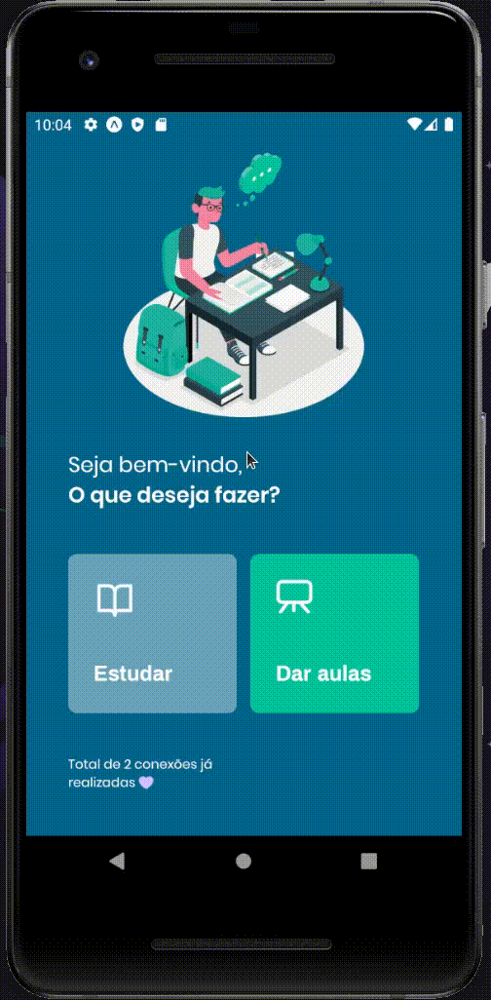

<p align="center">
  
</p>

# ℹ Sobre o Projeto
Projeto Proffy foi construido durante esta semana do dia 3 a 7 de agosto de 2020 na Next Level Week, tivemos mais de 110mil devs participando do evento.
Proffy é um projeto em homenagem ao dia 06 de agosto que é o dia nacional do profissional de educação! 👨‍🏫 <br>
Uma plataforma que conecta alunos com professores. 🎯

# 📣 O que é Next Level Week?

<p> 
 O NLW (antiga onmistack) é uma semana onde a <strong>Rocketseat</strong> mostram como montar uma aplicação do zero com as melhores tecnologias do mercado.
<br>
A Rocketseat tem a consciência que a prática é a melhor aula, então sempre nos inspiram e lançam desafios para a gente se virar sozinho!
</p>
<strong>Pilhares do metódo de ensino Rocketseat</strong><br>
<li><strong>Foco: </strong> Dominar todas as linguagens e tecnologias é impossível, por isso é importante focar para ir direto ao ponto sem perder tempo.</li>
<li><strong>Grupo: </strong> A comunidade de devs é uma das melhores comunidades que existem! Trabalhar em grupo é essencial, já perdi a conta de quantas vezes ajudei e fui ajudado com erros de programação.</li>
<li><strong>Prática: </strong> E claro, não podia faltar! Quando vemos uma aula, nós podemos entender os conceitos, mas só na prática que aprendemos realmente como faze-los! </li>

# :eyes: Preview do Projeto
<h3>Web</h3>


<h3>App Mobile (IOS & Android)</h3>


# :construction_worker: Como rodar o projeto
```bash
# Clone Repository
$ git clone https://github.com/marcusGoncalvess/nextLevelWeek2.0.git
```
### 📦 Ligar a API

```bash
# Vá até a pasta
$ cd Proffy/server

# Instale as dependencias
$ yarn install

# Ligue a API
$ yarn start
```
Access API at http://localhost:3333/

### 💻 Visualizar WebSite

```bash
# Vá até a pasta
$ cd Proffy/web

# Instale as dependencias
$ yarn install

# Ligue o servidor
$ yarn start
```
Vá para http://localhost:3000/ para ver o website.

### 📱 Rodar projeto no celular
Para ver o projeto no celular você precisa ter o [expo](https://play.google.com/store/apps/details?id=host.exp.exponent) instalado ou um emulador android/ios.
<br />
Depois, fork esse repositorio ou clone em sua máquina. Dentro do projeto rode os comandos:

```bash
# Ir para a pasta
$ cd Proffy/mobile

# Instale as dependencias
$ yarn install

# Ligue o App
$ yarn start
```
Irá abrir uma aba no seu navegador e apacerá um QR Code, se escanear ele no aplicativo Expo, abrirá a aplicação. Terá uma opção para rodar em um emulador também.

# 🛠 Tecnologias

As seguintes ferramentas foram usadas na construção do projeto:

- [Expo](https://expo.io/)
- [Node.js](https://nodejs.org/en/)
- [React](https://pt-br.reactjs.org/)
- [React Native](https://reactnative.dev/)
- [TypeScript](https://www.typescriptlang.org/)

# :memo: License

Esse projeto está sob a licença MIT. Veja o arquivo [LICENSE](./LICENSE) para mais detalhes.
